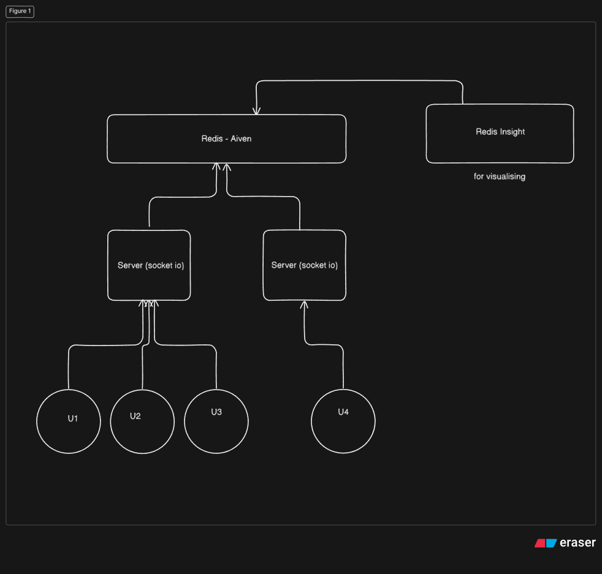

# 📡 Scalable Chat App (Turborepo)

This project demonstrates how to scale a WebSocket-based chat app using **Redis Pub/Sub (Aiven Redis) now (Valkey)** so that multiple backend servers can communicate with each other.

A simple **scalable chat application** built using a **monorepo architecture with Turborepo**

This project demonstrates how to structure a real-time chat app in a way that can scale by separating frontend and backend while sharing common logic.


---
## Architecture



--- 

## Scalability Test

3) Start Server #1 (Port 3000)

PORT=3000 npm run dev

2) Start Server #2 (Port 3001)

PORT=3001 npm run dev

4) Open multiple browser clients
Client connections

Tab 1 → http://localhost:3000

Tab 2 → http://localhost:3001

5) Send message from Client A

In browser connected to 3000:

Hello from Server 3000

Server 3000 logs:
Received message from socket XYZ
Publishing to Redis

6) Observe Server 3001 logs 🔥

Even though the client is NOT connected to it:

Redis message received

## 🧩 Project Structure

my-turborepo/
├── apps/
│ ├── web/ # 🚀 Frontend (React / Next.js)
│ └── server/ # 🛠 Backend (Node.js + Socket.IO)
├── packages/ # 📦 Shared packages (optional)
├── turbo.json
├── package.json
├── pnpm-lock.yaml
└── README.md


---

## 🛠 Tech Stack

- **Frontend:** React (Next.js App Router)
- **Backend:** Node.js + Socket.IO
- **Realtime Communication:** WebSockets
- **State Sharing:** React Context
- **Monorepo Tooling:** Turborepo
- **Package Manager:** pnpm

---

## 🚀 Getting Started (Local Setup)

### Install dependencies (from repo root)

```bash
pnpm install


